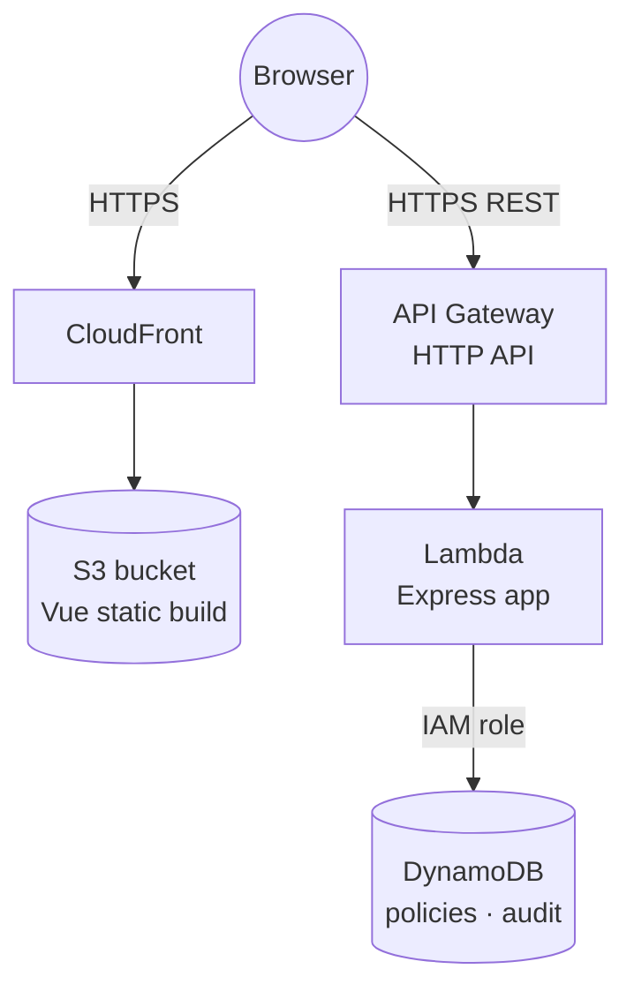

# Deployments

Two parts:

- **Part A — Local full stack.** What we built and how to run it end to end on your
  machine (Docker + DynamoDB Local). Reproducible in ~2 minutes.
- **Part B — Deploy to AWS.** A guided runbook **for you to drive**: DynamoDB,
  Lambda, and S3 + CloudFront, all with Terraform. Each step explains *what* it
  creates and *why*, with the commands to run and what to verify.

> Conventions: commands assume you start from the repo root
> `F:\Projects\mailguard-dlp` unless stated. Nothing here deletes data without
> telling you. AWS steps cost a little money while resources exist — see
> [Teardown & cost](#teardown--cost).

---

## Part A — Run the full stack locally

### Prerequisites
- Docker Desktop running
- Node 20+ and `pnpm` (`corepack enable` if needed)
- `pnpm install` run once at the repo root

### Steps

```bash
# 1. Start DynamoDB Local (empty in-memory DynamoDB on :8000)
docker compose up -d

# 2. Give the API its environment (endpoint = the local DynamoDB)
cp apps/api/.env.example apps/api/.env

# 3. Create the two tables (idempotent) then seed 5 policies
pnpm --filter @mailguard/api db:reset

# 4. Start the API (:3000)
pnpm --filter @mailguard/api dev
```

In a second terminal, point the frontend at the real API and start it:

```bash
# apps/web/.env
printf 'VITE_API_BASE_URL=http://localhost:3000\nVITE_ENABLE_MOCKS=false\n' > apps/web/.env

pnpm --filter @mailguard/web dev   # http://localhost:5173
```

> To run the frontend **standalone with mocked data** (no backend), instead set
> `VITE_API_BASE_URL=/api` and `VITE_ENABLE_MOCKS=true`.

### Verify
```bash
curl http://localhost:3000/health         # {"ok":true}
curl http://localhost:3000/policies        # 5 policies (a DynamoDB Scan)
```
Then open http://localhost:5173 — create a policy, compose an email with a card
number, watch it get blocked, send a clean one, see it in the Audit log.

### Stop / reset
```bash
docker compose down          # stop DynamoDB Local (in-memory data is discarded)
# After restarting the container, recreate + reseed:
pnpm --filter @mailguard/api db:reset
```

---

## Part B — Deploy to AWS

### What you'll build



The public entry point for the API is an **API Gateway HTTP API** proxying every
request to the Lambda. (A Lambda **Function URL** is a lighter-weight option and
is shown as an alternative at the end — but on some accounts an `auth = NONE`
Function URL returns `403` for anonymous callers, whereas an HTTP API is public
by default, so we use API Gateway as the reliable default.)

### Prerequisites
1. An AWS account and an IAM user/role with permissions for DynamoDB, Lambda,
   IAM, S3, and CloudFront.
2. **AWS CLI** installed and configured: `aws configure` (set a region, e.g.
   `ap-northeast-1`). Verify: `aws sts get-caller-identity`.
3. **Terraform** ≥ 1.6 installed: `terraform -version`.
4. **esbuild** to bundle the Lambda (added below).

Pick a region and a **globally-unique** S3 bucket name; you'll reuse them.

---

### Step 1 — Make the API Lambda-ready

The Express app runs unchanged; we just wrap it in a Lambda handler and bundle it.

1a. Add two dependencies to `apps/api`:
```bash
pnpm --filter @mailguard/api add serverless-http
pnpm --filter @mailguard/api add -D esbuild
```

1b. Create `apps/api/src/lambda.ts`:
```ts
import serverless from 'serverless-http';
import { createApp } from './app.js';

// API Gateway HTTP APIs deliver v2-format events, which serverless-http
// understands out of the box (so does a Lambda Function URL, if you use one).
export const handler = serverless(createApp());
```

1c. Add a build script to `apps/api/package.json` under `"scripts"`:
```json
"build:lambda": "esbuild src/lambda.ts --bundle --platform=node --target=node20 --format=esm --outfile=dist/lambda.mjs --external:@aws-sdk/* --banner:js=\"import{createRequire}from'module';const require=createRequire(import.meta.url);\""
```

Why these flags:
- `--bundle` folds Express, serverless-http, and our shared packages into one file.
- `--external:@aws-sdk/*` — the Node 20 Lambda runtime already includes AWS SDK v3,
  so we don't ship it (smaller, faster cold starts).
- the `--banner` shim lets the bundled CommonJS deps use `require` inside an ESM output.

1d. Build it:
```bash
pnpm --filter @mailguard/api build:lambda   # produces apps/api/dist/lambda.mjs
```

---

### Step 2 — Scaffold Terraform

Create an `infra/` folder with the files below.

`infra/providers.tf`
```hcl
terraform {
  required_version = ">= 1.6"
  required_providers {
    aws = { source = "hashicorp/aws", version = "~> 5.0" }
  }
}

provider "aws" {
  region = var.region
}
```

`infra/variables.tf`
```hcl
variable "region" {
  type    = string
  default = "ap-northeast-1"
}

variable "project" {
  type    = string
  default = "mailguard"
}

variable "web_bucket_name" {
  type        = string
  description = "Globally-unique S3 bucket name for the frontend"
}
```

`infra/terraform.tfvars.example` (copy to `terraform.tfvars` and edit)
```hcl
region          = "ap-northeast-1"
web_bucket_name = "mailguard-dlp-yourname-1234"
```

Initialize:
```bash
cd infra
terraform init
```

---

### Step 3 — DynamoDB tables

`infra/dynamodb.tf`
```hcl
resource "aws_dynamodb_table" "policies" {
  name         = "${var.project}-policies"
  billing_mode = "PAY_PER_REQUEST"      # on-demand: pay per request, nothing to provision
  hash_key     = "id"
  attribute {
    name = "id"
    type = "S"
  }
}

resource "aws_dynamodb_table" "audit" {
  name         = "${var.project}-audit"
  billing_mode = "PAY_PER_REQUEST"
  hash_key     = "id"
  attribute {
    name = "id"
    type = "S"
  }
}
```

Apply just the tables first so you can watch it work:
```bash
terraform apply -target=aws_dynamodb_table.policies -target=aws_dynamodb_table.audit
```
Verify in the AWS console (DynamoDB → Tables) or:
```bash
aws dynamodb list-tables --region ap-northeast-1
```

---

### Step 4 — Lambda + API Gateway

`infra/lambda.tf`
```hcl
# --- IAM: let Lambda assume a role, write logs, and access our two tables ---
data "aws_iam_policy_document" "assume" {
  statement {
    actions = ["sts:AssumeRole"]
    principals {
      type        = "Service"
      identifiers = ["lambda.amazonaws.com"]
    }
  }
}

resource "aws_iam_role" "api" {
  name               = "${var.project}-api-role"
  assume_role_policy = data.aws_iam_policy_document.assume.json
}

resource "aws_iam_role_policy_attachment" "logs" {
  role       = aws_iam_role.api.name
  policy_arn = "arn:aws:iam::aws:policy/service-role/AWSLambdaBasicExecutionRole"
}

data "aws_iam_policy_document" "ddb" {
  statement {
    actions = [
      "dynamodb:GetItem", "dynamodb:PutItem",
      "dynamodb:DeleteItem", "dynamodb:Scan", "dynamodb:Query"
    ]
    resources = [
      aws_dynamodb_table.policies.arn,
      aws_dynamodb_table.audit.arn
    ]
  }
}

resource "aws_iam_role_policy" "ddb" {
  name   = "${var.project}-ddb-access"
  role   = aws_iam_role.api.id
  policy = data.aws_iam_policy_document.ddb.json
}

# --- Package apps/api/dist into a zip Terraform can upload ---
data "archive_file" "api" {
  type        = "zip"
  source_dir  = "${path.module}/../apps/api/dist"
  output_path = "${path.module}/build/api.zip"
}

resource "aws_lambda_function" "api" {
  function_name    = "${var.project}-api"
  role             = aws_iam_role.api.arn
  runtime          = "nodejs20.x"
  handler          = "lambda.handler"          # file lambda.mjs, export handler
  filename         = data.archive_file.api.output_path
  source_code_hash = data.archive_file.api.output_base64sha256
  timeout          = 15
  memory_size      = 256

  environment {
    variables = {
      POLICIES_TABLE = aws_dynamodb_table.policies.name
      AUDIT_TABLE    = aws_dynamodb_table.audit.name
      # DYNAMODB_ENDPOINT intentionally UNSET → SDK uses real DynamoDB
    }
  }
}

```
(The Lambda file ends at the function — the public entry point lives in its own
file below.)

`infra/apigateway.tf`
```hcl
# Public entry point: an API Gateway HTTP API that proxies every request to the
# Lambda. HTTP APIs are publicly reachable by default (no anonymous-invoke
# resource policy to configure), which is why this is the reliable default.
#
# CORS is handled by the Express app's own cors() middleware, so we do NOT set
# cors_configuration here — doing both sends duplicate CORS headers, which
# browsers reject. The $default route forwards every method/path (including the
# OPTIONS preflight) to Express.

resource "aws_apigatewayv2_api" "api" {
  name          = "${var.project}-http-api"
  protocol_type = "HTTP"
}

resource "aws_apigatewayv2_integration" "api" {
  api_id                 = aws_apigatewayv2_api.api.id
  integration_type       = "AWS_PROXY"
  integration_uri        = aws_lambda_function.api.invoke_arn
  payload_format_version = "2.0"
}

resource "aws_apigatewayv2_route" "default" {
  api_id    = aws_apigatewayv2_api.api.id
  route_key = "$default" # catch-all; Express does the routing
  target    = "integrations/${aws_apigatewayv2_integration.api.id}"
}

resource "aws_apigatewayv2_stage" "default" {
  api_id      = aws_apigatewayv2_api.api.id
  name        = "$default"
  auto_deploy = true
}

resource "aws_lambda_permission" "apigw" {
  statement_id  = "AllowApiGatewayInvoke"
  action        = "lambda:InvokeFunction"
  function_name = aws_lambda_function.api.function_name
  principal     = "apigateway.amazonaws.com"
  source_arn    = "${aws_apigatewayv2_api.api.execution_arn}/*/*"
}

output "api_url" {
  value = aws_apigatewayv2_stage.default.invoke_url
}
```

Apply and grab the URL:
```bash
pnpm --filter @mailguard/api build:lambda   # rebuild if you changed code
terraform apply
terraform output api_url                     # https://xxxx.execute-api.<region>.amazonaws.com/
```
Verify (open in a browser, or use curl.exe on Windows):
```bash
curl "$(terraform output -raw api_url)health"     # {"ok":true}
```

---

### Step 5 — Seed the cloud tables (via the live API)

The tables start empty (`/policies` returns `[]`). The cleanest way to seed them
is **through the deployed API itself** — the POST goes API Gateway → Lambda →
DynamoDB using the Lambda's IAM role, so there are no local-credential or
endpoint pitfalls. Paste this into PowerShell (replace the URL with your
`terraform output -raw api_url`, no trailing slash):

```powershell
$api = "https://xxxx.execute-api.ap-northeast-1.amazonaws.com"
$policies = @(
  @{ name="Block credit card numbers"; enabled=$true;  action="block"; definition=@{ type="pii"; detector="credit_card" } },
  @{ name="Internal recipients only";  enabled=$true;  action="block"; definition=@{ type="recipientDomain"; mode="allowlist"; domains=@("corp.example") } },
  @{ name="Flag confidential";          enabled=$true;  action="warn";  definition=@{ type="keyword"; term="confidential"; caseSensitive=$false } },
  @{ name="Block executable attachments"; enabled=$true; action="block"; definition=@{ type="attachment"; blockedExtensions=@("exe","bat","js","scr") } },
  @{ name="Log phone numbers";          enabled=$false; action="log";   definition=@{ type="pii"; detector="phone" } }
)
foreach ($p in $policies) {
  Invoke-RestMethod -Method Post -Uri "$api/policies" -ContentType "application/json" -Body ($p | ConvertTo-Json -Depth 5) | Out-Null
  Write-Host "created: $($p.name)"
}
```
Confirm by opening `<api_url>/policies` — you should now see 5 policies.

> Alternative: run the local seed script against real AWS with
> `pnpm --filter @mailguard/api db:seed`, but first ensure `apps/api/.env` has
> **no** `DYNAMODB_ENDPOINT` and **no** `AWS_*` credential lines, so the SDK uses
> your `aws configure` profile against the real service. The API-POST method
> above avoids that setup entirely.

---

### Step 6 — Deploy the frontend (S3 + CloudFront)

`infra/frontend.tf`
```hcl
resource "aws_s3_bucket" "web" {
  bucket = var.web_bucket_name
}

resource "aws_cloudfront_origin_access_control" "web" {
  name                              = "${var.project}-oac"
  origin_access_control_origin_type = "s3"
  signing_behavior                  = "always"
  signing_protocol                  = "sigv4"
}

resource "aws_cloudfront_distribution" "web" {
  enabled             = true
  default_root_object = "index.html"

  origin {
    domain_name              = aws_s3_bucket.web.bucket_regional_domain_name
    origin_id                = "s3-web"
    origin_access_control_id = aws_cloudfront_origin_access_control.web.id
  }

  default_cache_behavior {
    target_origin_id       = "s3-web"
    viewer_protocol_policy = "redirect-to-https"
    allowed_methods        = ["GET", "HEAD"]
    cached_methods         = ["GET", "HEAD"]
    cache_policy_id        = "658327ea-f89d-4fab-a63d-7e88639e58f6" # AWS "CachingOptimized"
  }

  # SPA fallback: let Vue Router handle unknown paths
  custom_error_response {
    error_code         = 403
    response_code      = 200
    response_page_path = "/index.html"
  }
  custom_error_response {
    error_code         = 404
    response_code      = 200
    response_page_path = "/index.html"
  }

  restrictions {
    geo_restriction { restriction_type = "none" }
  }
  viewer_certificate { cloudfront_default_certificate = true }
}

# Allow only this CloudFront distribution to read the bucket
data "aws_iam_policy_document" "web" {
  statement {
    actions   = ["s3:GetObject"]
    resources = ["${aws_s3_bucket.web.arn}/*"]
    principals {
      type        = "Service"
      identifiers = ["cloudfront.amazonaws.com"]
    }
    condition {
      test     = "StringEquals"
      variable = "AWS:SourceArn"
      values   = [aws_cloudfront_distribution.web.arn]
    }
  }
}

resource "aws_s3_bucket_policy" "web" {
  bucket = aws_s3_bucket.web.id
  policy = data.aws_iam_policy_document.web.json
}

output "web_url" {
  value = "https://${aws_cloudfront_distribution.web.domain_name}"
}
```

Apply:
```bash
terraform apply          # CloudFront takes a few minutes to deploy
```

Build the frontend pointed at your API Gateway URL, then upload.

First get the API URL:
```bash
cd infra && terraform output -raw api_url    # e.g. https://abc.execute-api.<region>.amazonaws.com/
```

Create `apps/web/.env.production` with the URL **minus its trailing slash** (the
client joins `BASE + "/policies"`, so a trailing slash would produce `//policies`
and break routing). Put exactly these two lines in the file — editing it in your
editor avoids shell-quoting and file-encoding (BOM) pitfalls:
```
VITE_API_BASE_URL=https://abc.execute-api.ap-northeast-1.amazonaws.com
VITE_ENABLE_MOCKS=false
```

Build, then **confirm the URL was baked in** before uploading:
```bash
pnpm --filter @mailguard/web build
```
```powershell
# PowerShell: should print a line containing your API URL
Select-String -Path apps\web\dist\assets\*.js -Pattern "execute-api" | Select-Object -First 1
```
```bash
# bash equivalent
grep -l "execute-api" apps/web/dist/assets/*.js
```
If that finds nothing, the env file wasn't read — fix it before deploying.

Upload (use your actual bucket name):
```bash
aws s3 sync apps/web/dist s3://<your-bucket-name> --delete
```

Invalidate the CDN cache so the new build shows immediately:
```powershell
# PowerShell
$distId = aws cloudfront list-distributions --query "DistributionList.Items[?Origins.Items[0].Id=='s3-web'].Id" --output text
aws cloudfront create-invalidation --distribution-id $distId --paths "/*"
```
```bash
# bash
DIST_ID=$(aws cloudfront list-distributions \
  --query "DistributionList.Items[?Origins.Items[0].Id=='s3-web'].Id" --output text)
aws cloudfront create-invalidation --distribution-id "$DIST_ID" --paths "/*"
```

---

### Step 7 — Verify end-to-end
```bash
cd infra && terraform output web_url        # open this in a browser
```
Create a policy, compose a violating email, send a clean one, check the audit log
— all now backed by real Lambda + DynamoDB.

---

### Teardown & cost

While they exist, these resources cost a little: DynamoDB on-demand (pennies at
this scale), Lambda (free tier covers light use), S3 (cents), CloudFront (cents).
To remove **everything**:

```bash
cd infra
terraform destroy
```
DynamoDB tables are deleted with their data. The S3 bucket must be empty first; if
`destroy` complains, run `aws s3 rm s3://<bucket> --recursive` then retry.

> Never commit `terraform.tfstate` or `.env` files — they're already gitignored.

---

### Going further (optional)
- **Lambda Function URL** instead of API Gateway: lighter (one fewer service) via
  `aws_lambda_function_url` (`authorization_type = "NONE"`) plus an
  `aws_lambda_permission` with `function_url_auth_type = "NONE"`. Note that some
  accounts return `403` for anonymous Function-URL calls even when configured
  correctly — hence API Gateway as the default here.
- **Tighten CORS**: the HTTP API forwards to Express, whose `cors()` currently
  allows all origins. Restrict it to your CloudFront domain for production.
- **Custom domain + Route 53**: an ACM cert (in `us-east-1` for CloudFront) +
  `aws_route53_record` aliases for the distribution and the API.
- **CI/CD**: a GitHub Actions workflow that runs tests, `build:lambda`,
  `terraform apply`, and the S3 sync on push to `main`.
