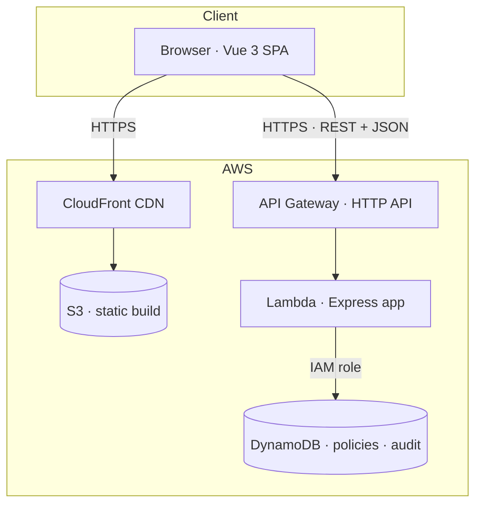
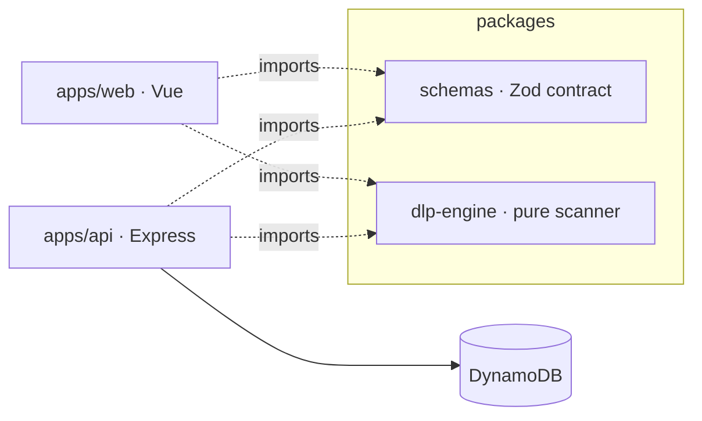
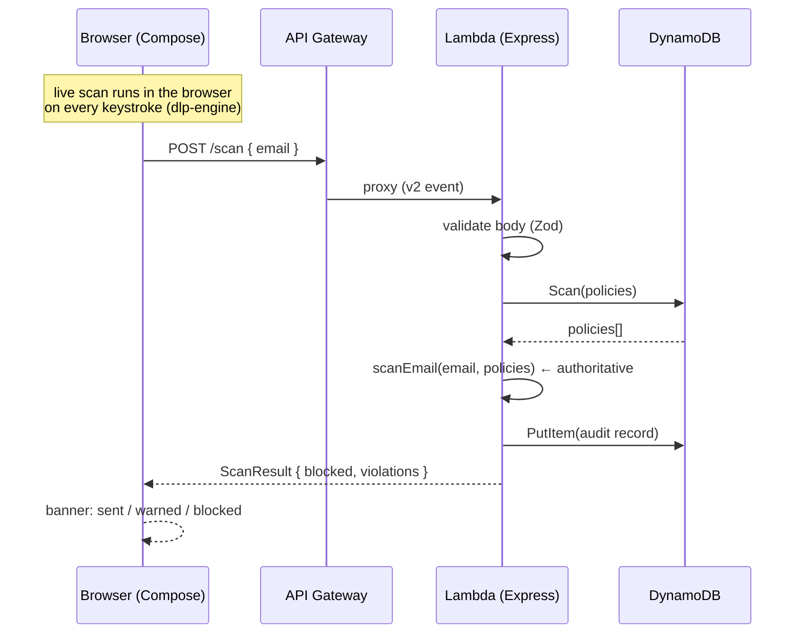
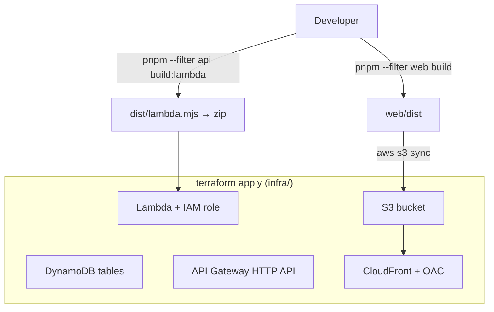

# MailGuard DLP

> An email **Data Loss Prevention** policy console — define rules, scan outgoing
> mail in real time, block or warn on sensitive data, and audit every attempt.
> Full-stack **TypeScript**, deployed **serverless on AWS**.

**🌐 Live demo:** https://d26cwmluxv9v39.cloudfront.net

<!-- Add a screenshot / GIF here for extra impact:
 -->

---

## Overview

MailGuard DLP is a small but complete B2B-style admin tool. An administrator
defines **DLP policies** (e.g. "block messages containing a credit-card number",
"only allow internal recipients"). A **compose simulator** then scans an outgoing
email against those policies **live as you type**, blocks it when a policy
requires, and records every scan in an **audit log**.

It's built as a **pnpm monorepo** with a strict separation between a pure,
reusable core and the app layers around it:

- A **framework-agnostic rule engine** (`packages/dlp-engine`) that runs the same
  code in the browser (instant feedback) and on the server (the authoritative
  check) — *scan on the client for UX, trust the server for truth*.
- A **single Zod schema package** (`packages/schemas`) imported by both the
  frontend and backend, so types and runtime validation can never drift apart.

---

## Features

- 🛡️ **Policy management** — CRUD for five rule types: keyword, regex, PII
  (credit card via the **Luhn** checksum, email, phone, national ID),
  recipient-domain allow/block-list, and attachment (extension/size).
- ⚡ **Live scanning** — violations appear reactively on every keystroke; the
  **Send** button is disabled while a blocking policy matches.
- ✅ **Authoritative server re-scan** — the server re-runs the engine against its
  own policies before "sending", so the client can't be trusted around it.
- 📝 **Audit log** — every scan attempt (allowed or blocked) is persisted.
- ♿ **Accessible** — real labels, `aria-invalid`, `role="switch"`, keyboard
  operability, live-region announcements.
- 🌐 **Internationalized** — English / Japanese, light & dark themes.
- ☁️ **Serverless** — Lambda + API Gateway + DynamoDB + S3/CloudFront, all as
  Terraform. Runs fully offline in dev via DynamoDB Local.

---

## Architecture

### Deployed system



### Monorepo & the shared core

The two `packages/*` are imported by **both** apps — one source of truth for
data shapes and for the scanning logic.



### Control flow — send → scan → audit



### Validation, defense-in-depth

DynamoDB is schemaless (it enforces only the `id` key), so **the Zod schemas are
the schema** — validated at every boundary:

```
User input → [client Zod] → HTTP → [server Zod] → engine → DynamoDB
                 ▲                      ▲
          fast UX feedback      never trust the client
```

### AWS deployment flow



See **[Deployments.md](Deployments.md)** for the full step-by-step runbook, and
**[docs/ARCHITECTURE.md](docs/ARCHITECTURE.md)** for deeper control-flow diagrams.

---

## Tech stack

| Layer | Tools |
|-------|-------|
| **Frontend** | Vue 3 (Composition API), Pinia, Vue Router, Vite, vue-i18n |
| **Shared core** | TypeScript, **Zod** schemas, a pure rule-engine package |
| **Backend** | Node.js, **Express**, AWS SDK v3 (DynamoDB DocumentClient) |
| **Data** | **DynamoDB** (DynamoDB Local in dev via Docker) |
| **Infra** | **Terraform** → Lambda, API Gateway, S3, CloudFront, IAM |
| **Tooling** | pnpm workspaces, **Biome** (lint/format), Vitest, Docker, MSW |

---

## Project structure

```
mailguard-dlp/
├── packages/
│   ├── schemas/       # Zod schemas + inferred types (shared contract)
│   └── dlp-engine/    # pure scan engine; runs in browser AND on Lambda
├── apps/
│   ├── web/           # Vue 3 + Vite frontend
│   └── api/           # Express API (DynamoDB) + Lambda handler
├── infra/             # Terraform: DynamoDB · Lambda · API Gateway · S3 · CloudFront
├── docs/ARCHITECTURE.md
├── Deployments.md
└── docker-compose.yml # DynamoDB Local for offline development
```

---

## Getting started (local)

**Prerequisites:** Node 20+, pnpm, Docker Desktop.

```bash
pnpm install

# 1. Start DynamoDB Local, then create + seed the tables
docker compose up -d
pnpm --filter @mailguard/api db:reset

# 2. Start the API (:3000)
pnpm --filter @mailguard/api dev

# 3. In another terminal, start the web app (:5173)
printf 'VITE_API_BASE_URL=http://localhost:3000\nVITE_ENABLE_MOCKS=false\n' > apps/web/.env
pnpm --filter @mailguard/web dev
```

Open http://localhost:5173.

> **Frontend-only mode (no backend):** set `VITE_API_BASE_URL=/api` and
> `VITE_ENABLE_MOCKS=true`. An in-browser **MSW** mock serves seeded data, so the
> UI runs and deploys entirely standalone.

---

## Testing

```bash
pnpm test          # run all package tests
pnpm typecheck     # strict TypeScript across every package
pnpm lint          # Biome
```

The pure core is unit-tested with **Vitest** — the Luhn checksum, each detector,
the rule-engine orchestration, and the Zod schemas (incl. false-positive guards,
e.g. a 16-digit number that fails Luhn must *not* be flagged as a card).

---

## Deployment

Everything is Terraform. In short: build the Lambda bundle and the web app,
`terraform apply` the infrastructure, seed the tables through the live API, then
`aws s3 sync` the frontend to CloudFront. The full guided runbook — including how
to verify each step and tear it all down — is in **[Deployments.md](Deployments.md)**.

```bash
cd infra && terraform destroy   # remove all AWS resources when done
```

---

## Design highlights

- **One engine, two homes.** `scanEmail()` is pure and dependency-free, so the
  browser uses it for instant feedback and the Lambda uses it as the trusted
  gate — no duplicated logic, and a natural client/server trust boundary.
- **Schemas as the single source of truth.** A shared Zod package gives
  end-to-end types *and* runtime validation at both the client and server edges,
  which matters because the datastore itself is schemaless.
- **One switch, local ↔ cloud.** A single env var (`DYNAMODB_ENDPOINT`) points
  the identical code at DynamoDB Local or real AWS.
- **API Gateway over Lambda Function URL.** The public entry point is an HTTP API
  (public by default) rather than a Function URL, which on some accounts refuses
  anonymous calls — a deliberate, documented trade-off.

---

## License

MIT — see `LICENSE`.
