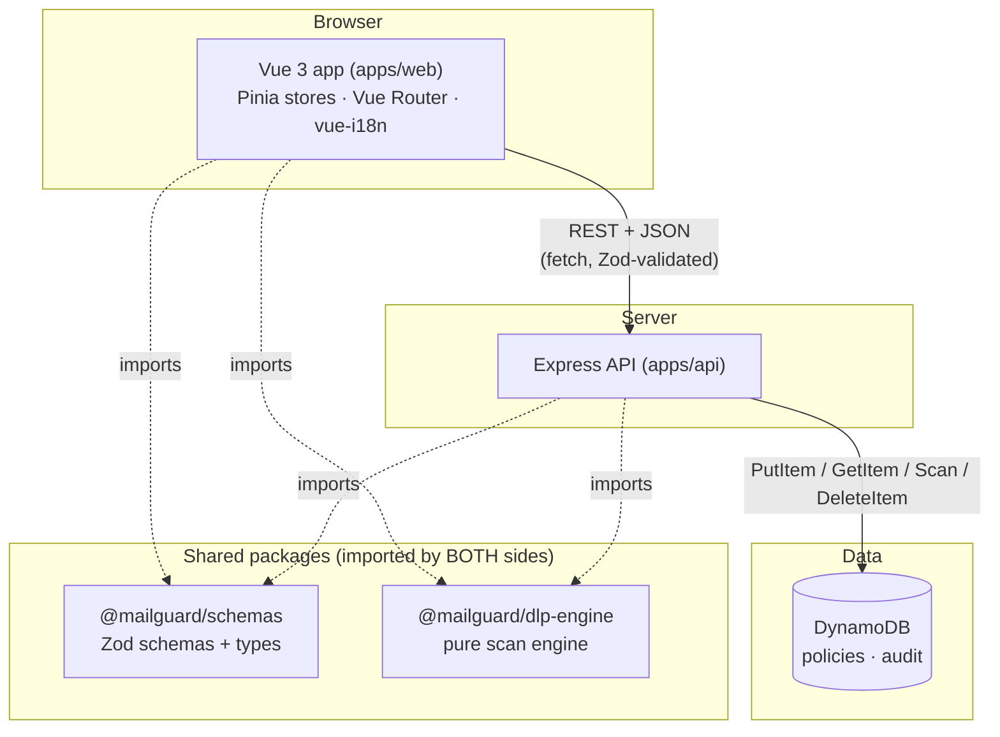
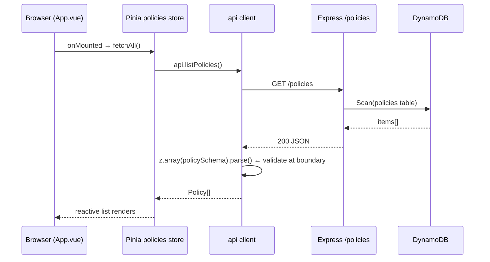
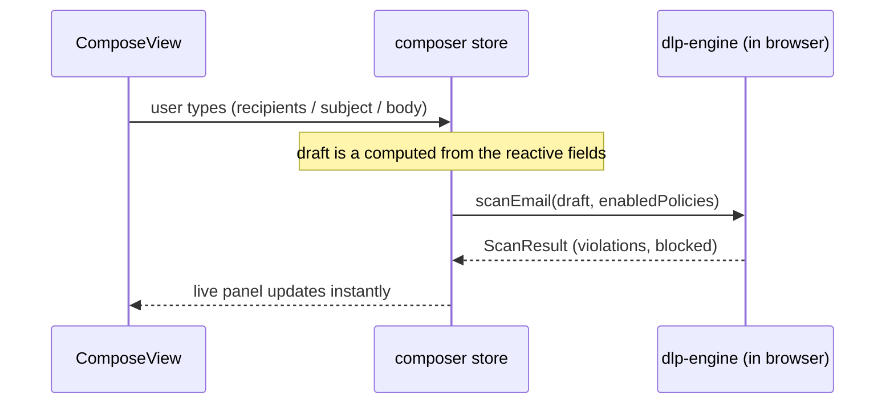
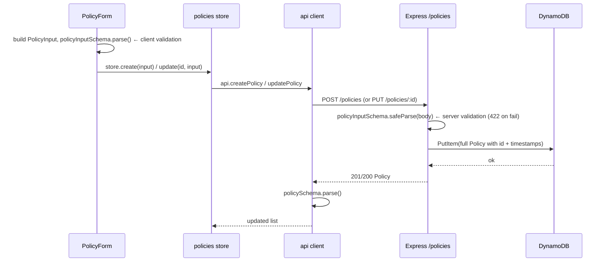
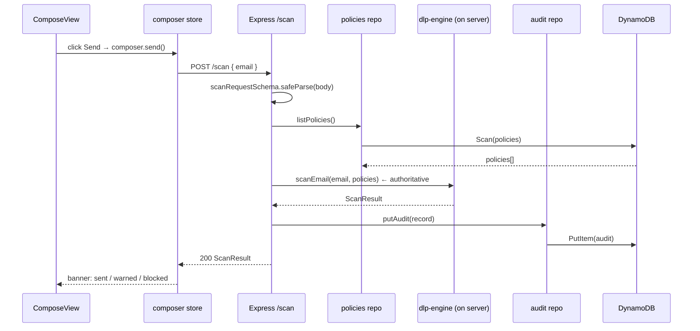
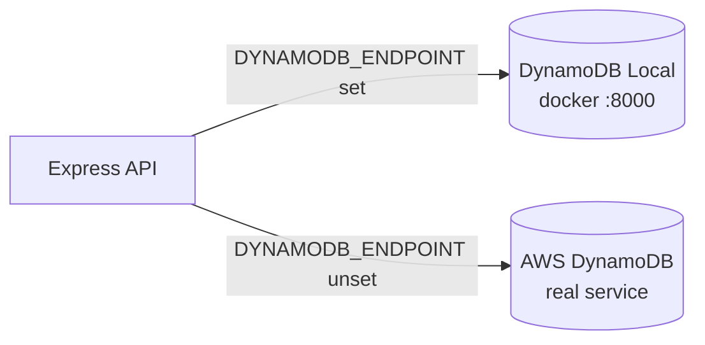

# Architecture & Control Flow

MailGuard DLP is a small full-stack app with a deliberately clean separation of
layers. This document explains **what the pieces are** and **how data flows**
through them.

---

## 1. The big picture



**The key idea:** the two shared packages are imported by *both* the browser and
the server.

- **`@mailguard/schemas`** is the single source of truth for every data shape.
  The frontend validates API responses with it; the backend validates request
  bodies with it. Types and runtime validation can never drift apart.
- **`@mailguard/dlp-engine`** is a pure function (`scanEmail`). The browser runs
  it for instant feedback while typing; the server runs the *same code* as the
  authoritative check. "Scan on the client for UX, trust the server for truth."

---

## 2. Layers within each app

| Layer | Frontend (`apps/web`) | Backend (`apps/api`) |
|-------|-----------------------|----------------------|
| Entry | `main.ts` → `App.vue` | `index.ts` → `app.ts` |
| Routing | Vue Router (`router.ts`) | Express routers (`routes/*`) |
| State / logic | Pinia stores (`stores/*`) | route handlers |
| Data access | typed `api` client (`api/client.ts`) | repos (`db/policies.ts`, `db/audit.ts`) |
| Boundary validation | Zod on every response | Zod on every request body |
| External system | the REST API | DynamoDB (`db/client.ts`) |

---

## 3. Control flow — the four journeys

### 3a. App load → list policies



### 3b. Live scan while typing (NO network)



This is the "derive, don't store" pattern: `liveResult` is a `computed` over the
draft + enabled policies, so it recomputes on every keystroke with zero network
calls. The Send button is disabled while `blocked` is true.

### 3c. Create / update a policy



Note the **double validation**: the client checks before sending (fast UX), and
the server checks again because it must never trust the client.

### 3d. Send → authoritative scan + audit (the core flow)



The audit record is written on **every** send attempt — allowed or blocked —
because a DLP system logs attempts, not just successes.

---

## 4. Local vs. cloud — one switch

The backend talks to DynamoDB Local or real AWS based on a single env var:



No code changes between dev and prod — see `apps/api/src/db/client.ts`. The same
principle applies to the frontend: `VITE_API_BASE_URL` points at the local
Express server or the deployed API Gateway URL, and `VITE_ENABLE_MOCKS` swaps the
in-browser MSW mock in or out.

---

## 5. Where validation lives (defense in depth)

```
User input → [client Zod] → HTTP → [server Zod] → engine → DynamoDB
                 ▲                       ▲
         fast UX feedback        never trust the client
```

DynamoDB itself is schemaless (it only enforces the `id` key), so **our schemas
are the schema.** That is exactly why `@mailguard/schemas` is a shared package
rather than duplicated types on each side.
